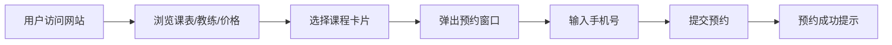

## 1. 产品概述
为健身工作室打造的课程预约网站，帮助会员便捷查看课表、预约课程、了解教练团队和会员卡方案。
- 解决问题：传统电话/微信预约效率低，课表信息不透明，会员难以快速获取课程和教练信息
- 目标用户：健身工作室会员及潜在客户
- 产品价值：提升预约效率，降低运营成本，增强工作室品牌形象

## 2. 核心功能

### 2.1 功能模块
1. **首页/课表页**：本周课表卡片展示、课程详情、手机号预约弹窗
2. **教练介绍页**：横向滑动教练卡片、头像/擅长方向/个人简介
3. **价格页**：月卡/季卡/年卡三列对比、选中高亮边框动效
4. **导航系统**：桌面端顶部固定导航、移动端底部Tab栏

### 2.3 页面详情
| 页面名称 | 模块名称 | 功能描述 |
|-----------|-------------|---------------------|
| 首页/课表页 | 周课表切换 | 横向展示周一至周日，点击切换日期 |
| 首页/课表页 | 课程卡片 | 显示课程名、教练、时间、剩余名额，悬停有上浮动效 |
| 首页/课表页 | 预约弹窗 | 点击课程卡片弹出，输入手机号提交预约 |
| 教练介绍页 | 教练卡片横滑 | 可左右滑动浏览教练，卡片含头像、姓名、擅长方向、简介 |
| 价格页 | 会员卡对比 | 三列并排，月卡/季卡/年卡方案对比，选中高亮边框+动画 |
| 公共模块 | 顶部导航栏 | 固定顶部，深灰背景，亮绿色高亮按钮，logo+三个页面链接 |
| 公共模块 | 底部Tab栏 | 移动端显示，固定底部，三个Tab切换 |

## 3. 核心流程
用户访问网站 → 通过导航选择页面（课表/教练/价格）→ 浏览课表 → 点击感兴趣课程 → 弹出预约窗口 → 输入手机号提交 → 预约成功提示

## 4. 用户界面设计

### 4.1 设计风格
- 主色调：深灰色 `#1F2937`（导航栏）、亮绿色 `#22C55E`（高亮按钮/强调色）
- 背景色：浅灰色 `#F3F4F6`（页面底色）、白色 `#FFFFFF`（卡片底色）
- 按钮风格：圆角 `rounded-xl`，亮绿色实心按钮，悬停加深
- 字体：展示字体用 Poppins，正文字体用 Noto Sans SC
- 布局风格：卡片式布局，大量圆角 `rounded-2xl`，柔和阴影
- 图标：使用 lucide-react 图标库

### 4.2 页面设计概览
| 页面名称 | 模块名称 | UI 元素 |
|-----------|-------------|-------------|
| 首页/课表页 | 周切换栏 | 横向排列7天，选中日亮绿背景+白字 |
| 首页/课表页 | 课程卡片网格 | 响应式网格（桌面3列、平板2列、手机1列）|
| 首页/课表页 | 预约弹窗 | 居中模态框，半透明遮罩，淡入动画 |
| 教练介绍页 | 横向滑动区 | overflow-x-auto，卡片宽度固定，间距均匀 |
| 价格页 | 会员卡三列 | 选中卡片亮绿边框 + 缩放动效 + pulse 阴影 |
| 公共模块 | 导航栏 | 固定定位，滚动时阴影加深 |

### 4.3 响应式设计
- 桌面端（≥1024px）：顶部导航栏，三列课程卡片，三列价格对比
- 平板端（768px-1023px）：顶部导航栏，两列课程卡片，三列价格对比缩小
- 移动端（<768px）：隐藏顶部导航，显示底部Tab栏，单列课程卡片，价格卡片纵向堆叠
