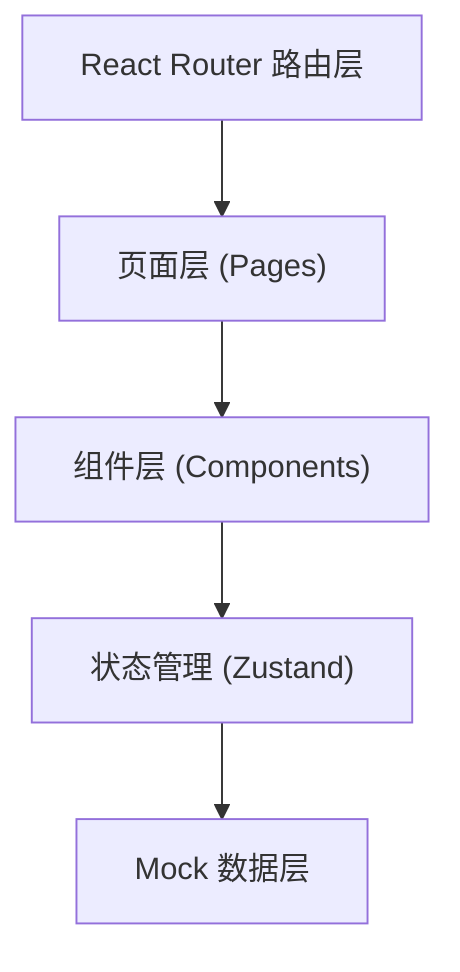

## 1. 架构设计
纯前端单页应用，使用 React Router 进行路由管理，所有数据使用本地 Mock 数据。



## 2. 技术描述
- 前端：React@18 + TypeScript + Vite
- 样式：TailwindCSS@3
- 路由：react-router-dom@6
- 状态管理：zustand
- 图标：lucide-react
- 后端：无（纯前端 Mock 数据）
- 数据库：无

## 3. 路由定义
| 路由 | 用途 |
|-------|---------|
| / | 首页/课表页（默认路由） |
| /coaches | 教练介绍页 |
| /pricing | 价格页 |

## 4. 数据模型（Mock 数据）

### 4.1 课程数据类型
```typescript
interface Course {
  id: string;
  name: string;
  coach: string;
  coachId: string;
  date: string; // YYYY-MM-DD
  startTime: string; // HH:mm
  duration: number; // 分钟
  totalSpots: number;
  remainingSpots: number;
  category: '力量' | '有氧' | '瑜伽' | '搏击' | '舞蹈';
}
```

### 4.2 教练数据类型
```typescript
interface Coach {
  id: string;
  name: string;
  avatar: string;
  specialties: string[];
  bio: string;
  experience: number; // 年
}
```

### 4.3 会员卡数据类型
```typescript
interface Membership {
  id: string;
  type: '月卡' | '季卡' | '年卡';
  price: number;
  originalPrice: number;
  features: string[];
  popular?: boolean;
}
```

### 4.4 预约数据类型
```typescript
interface Booking {
  courseId: string;
  phone: string;
  timestamp: number;
}
```

## 5. 项目结构
```
src/
├── components/        # 可复用组件
│   ├── Navbar.tsx         # 桌面端顶部导航
│   ├── BottomTabBar.tsx   # 移动端底部Tab
│   ├── CourseCard.tsx     # 课程卡片
│   ├── CoachCard.tsx      # 教练卡片
│   ├── PriceCard.tsx      # 价格卡片
│   └── BookingModal.tsx   # 预约弹窗
├── pages/             # 页面组件
│   ├── Schedule.tsx       # 课表首页
│   ├── Coaches.tsx        # 教练介绍页
│   └── Pricing.tsx        # 价格页
├── store/             # Zustand 状态管理
│   └── useBookingStore.ts
├── data/              # Mock 数据
│   ├── courses.ts
│   ├── coaches.ts
│   └── memberships.ts
├── types/             # TypeScript 类型定义
│   └── index.ts
├── App.tsx
├── main.tsx
└── index.css
```
